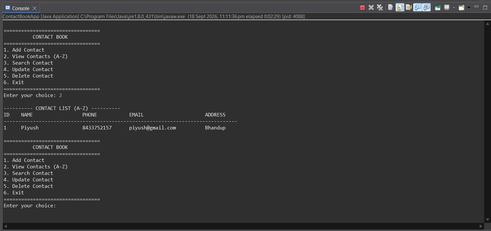

# JDBC Contact Book

A console-based Contact Book application developed using **Java, JDBC, MySQL, and Maven**.

## 📌 Project Overview

The JDBC Contact Book is a Java application that allows users to manage contact information using a MySQL database.

## 📸 Project Screenshot



The project demonstrates how Java applications communicate with a relational database using **JDBC (Java Database Connectivity)**.

## ✨ Features

* Add a new contact
* View contacts
* Update contact information
* Delete a contact
* Search contacts
* Store contact information in MySQL
* Sort contacts alphabetically by name
* Use `PreparedStatement` for database operations

## 🛠️ Technologies Used

* **Java**
* **JDBC**
* **MySQL**
* **Maven**
* **Eclipse IDE**

## 📂 Project Structure

```text
ContactBook
│
├── src
│   └── main
│       └── java
│           └── com.contactbook
│               ├── ContactBookApp.java
│               │
│               ├── dao
│               │   └── ContactDAO.java
│               │
│               ├── model
│               │   └── Contact.java
│               │
│               └── util
│                   └── DBConnection.java
│
├── database
│   └── contactbook.sql
│
├── pom.xml
├── .gitignore
└── README.md
```

## ⚙️ Setup and Installation

### 1. Clone the repository

```bash
git clone https://github.com/peeyush19/jdbc-contact-book.git
```

### 2. Open the project

Open the project in **Eclipse** or another Java IDE.

### 3. Configure MySQL

Create the database using the SQL file:

```text
database/contactbook.sql
```

### 4. Configure database connection

Open:

```text
DBConnection.java
```

Update your MySQL username, password, and database details.

### 5. Run the application

Run:

```text
ContactBookApp.java
```

## 🔐 Security Note

Do not commit real database passwords or other sensitive credentials to GitHub.

## 🚀 Future Improvements

* Convert the project to Spring Boot
* Create REST APIs
* Use Spring Data JPA/Hibernate
* Add a web-based frontend
* Add user authentication
* Add contact validation
* Add pagination and advanced search

## 👨‍💻 Author

**Piyush Thakur**

Java Full-Stack Developer in progress.
